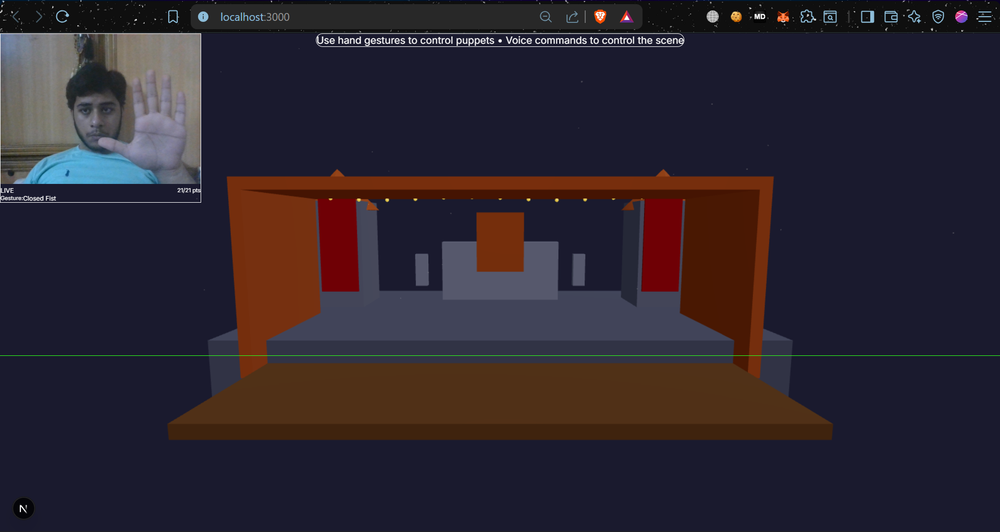

# Gesture Detection Fixes & How the Puppet System Works

## Issues Fixed

### 1. MediaPipe Module.arguments Error
**Problem**: The latest MediaPipe versions from CDN had breaking changes with the `Module.arguments` API.

**Solution**: Pinned to stable versions:
- `@mediapipe/camera_utils@0.3.1640029074`
- `@mediapipe/hands@0.4.1646424915`

These versions are compatible and don't have the Module.arguments issue.

### 2. Inverted Gesture Detection
**Problem**: The finger extension detection was using `tip.y < pip.y`, but in MediaPipe coordinates:
- Lower Y values = higher on screen
- Higher Y values = lower on screen

This caused open palms to be detected as closed fists!

**Solution**: Fixed the logic to properly detect finger extension:
```typescript
// For fingers: tip should have LOWER y than pip (higher on screen)
const tipToPipDist = pip.y - tip.y;
return tipToPipDist > 0.02 && tipToPipDist > pipToMcpDist * 0.3;
```

### 3. Improved Gesture Classification
**Changes Made**:
- **Open Palm**: Requires 4-5 extended fingers (confidence: 0.95)
- **Closed Fist**: 0 fingers or only thumb extended (confidence: 0.85-0.9)
- **Pinch**: Thumb and index finger close together (confidence: 0.9)
- **Transitional States**: 2-3 fingers treated as "none" to avoid false positives

### 4. Better Smoothing
- Reduced history size from 10 to 8 frames for faster response
- Requires 4 out of 8 frames to confirm a gesture
- Minimum 3 frames before smoothing kicks in

## How the Puppet System Works

### Architecture Overview

```
User Hand → Webcam → MediaPipe → Gesture Recognition → Puppet State → 3D Rendering
```

### Components

#### 1. **Hand Tracking** (`lib/mediapipe/handTracking.ts`)
- Loads MediaPipe Hands library from CDN
- Initializes camera and hand detection
- Provides 21 hand landmarks (3D coordinates) per detected hand
- Runs at ~30 FPS

#### 2. **Gesture Recognition** (`lib/gestures/gestureRecognition.ts`)
- Analyzes 21 hand landmarks to determine finger states
- Classifies gestures:
  - **Open Palm**: All fingers extended
  - **Closed Fist**: All fingers curled
  - **Pinch**: Thumb and index finger touching
- Smooths gestures over time to prevent jitter

#### 3. **Hand Tracking Hook** (`hooks/useHandTracking.ts`)
- Connects MediaPipe to React state
- Maps hand position to puppet position
- Triggers puppet actions based on gestures:
  - **Open Palm** → Puppet opens hand, neutral emotion
  - **Closed Fist** → Puppet shows angry emotion
  - **Pinch** → Puppet grabs objects
  - **Swipe Left** → Sad emotion
  - **Swipe Right** → Happy emotion

#### 4. **Puppet Character** (`components/scene/PuppetCharacter.tsx`)
- 3D puppet rendered with Three.js/React Three Fiber
- Components:
  - **Head**: Sphere with eyes, mouth, and accessories
  - **Body**: Cylinder with arms
  - **Emotions**: Different eye/mouth shapes
  - **Animations**: Floating, head bobbing

#### 5. **State Management** (`store/index.ts`)
- Zustand store manages:
  - Puppet position (x, y, z)
  - Puppet rotation
  - Current gesture
  - Emotion state
  - Grabbing state

### Gesture → Puppet Mapping

| Hand Gesture | Puppet Response |
|--------------|-----------------|
| Open Palm (5 fingers) | Opens hand, neutral face, stops grabbing |
| Closed Fist (0 fingers) | Angry face |
| Pinch | Starts grabbing objects |
| Swipe Left | Sad face |
| Swipe Right | Happy face |
| Hand Movement | Puppet follows hand position |

### Coordinate Mapping

**Hand Coordinates** (MediaPipe):
- X: 0 (left) to 1 (right)
- Y: 0 (top) to 1 (bottom)

**Puppet Coordinates** (3D Scene):
- X: -2 (left) to 2 (right)
- Y: 0.3 (bottom) to 2.5 (top)
- Z: 0 (depth)

**Mapping Formula**:
```typescript
const mappedX = (gesture.position.x - 0.5) * 4;  // Center and scale
const mappedY = 0.5 + (1 - gesture.position.y) * 2;  // Invert Y and scale
```

### Performance Optimizations

1. **Lerp (Linear Interpolation)**: Smooth puppet movement
   ```typescript
   newX = currentX + (targetX - currentX) * 0.1
   ```

2. **Gesture Smoothing**: Prevents jittery detection
   - Uses 8-frame history
   - Requires 50% consistency (4/8 frames)

3. **Confidence Thresholds**: Filters out uncertain detections
   - Minimum 0.6 confidence to trigger actions

4. **Model Complexity**: Set to 0 (fastest) for real-time performance

## Testing the Fixes

1. **Restart the dev server**:
   ```bash
   npm run dev
   ```

2. **Test Open Palm**:
   - Show all 5 fingers extended
   - Puppet should appear and show neutral face
   - Should NOT disappear

3. **Test Closed Fist**:
   - Close all fingers
   - Puppet should show angry face

4. **Test Movement**:
   - Move hand left/right/up/down
   - Puppet should follow smoothly

5. **Test Pinch**:
   - Touch thumb and index finger
   - Puppet should grab

## Troubleshooting

### Puppet Still Disappears
- Check browser console for errors
- Ensure webcam permissions are granted
- Try refreshing the page

### Gestures Not Detected
- Ensure good lighting
- Keep hand in frame
- Try moving hand closer to camera

### Laggy Performance
- Close other browser tabs
- Reduce browser window size
- Check CPU usage

## Technical Details

### MediaPipe Hand Landmarks
21 landmarks per hand:
- 0: Wrist
- 1-4: Thumb (CMC, MCP, IP, TIP)
- 5-8: Index finger (MCP, PIP, DIP, TIP)
- 9-12: Middle finger
- 13-16: Ring finger
- 17-20: Pinky finger

### Finger Extension Detection
For each finger (except thumb):
1. Calculate vertical distance: `pip.y - tip.y`
2. If positive and > 0.02, finger is extended
3. Compare to pip-to-mcp distance for validation

For thumb (horizontal):
1. Calculate distance from wrist to tip
2. Compare to distance from wrist to MCP
3. If tip is 10% farther, thumb is extended